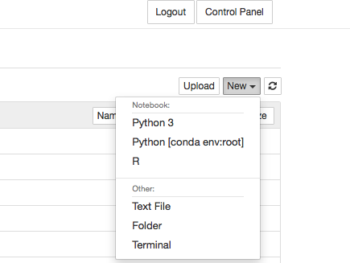
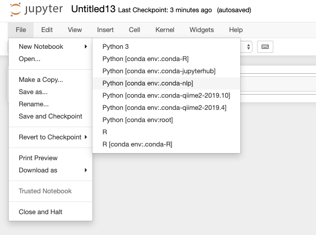

# Conda environments in JupyterHub

Custom environments created by users can also be used on JupyterHub. This QuickByte shows you how to make python environments  accessible on JupyterHub. 

## In Terminal 

If you are creating a conda environment from scrach that you know you will want to use on JupyterHub, as you are creating the environment add the ipykernel to the packages you want included.

For example, if you were making a natural language processing libraries environment, you could create an environment like this:

``` 
module load miniconda3
conda create -n nltk nltk ipykernel
```

Alternatively, if you already have an environment created and would like it to be available on JupyterHub, then add the ipykernal. 

``` 
source activate nltk
conda install ipykernel
```

Remember that you can also access the terminal though JupyterHub. To do this click Terminal under the New dropdown menu. 



## On JupyterHub

After your environments have been modified to include the ipykernal, you can open notebooks on JupyterHub by opening a New Notebook under File and selecting the environment. 



<p class="carc-provenance" markdown>Migrated from [UNM-CARC QuickBytes](https://github.com/UNM-CARC/QuickBytes/blob/master/Conda_JupyterHub.md) (last source update 2023-06-27). Spotted a problem? [Open an issue or pull request](https://github.com/UNM-CARC/QuickBytes).</p>
