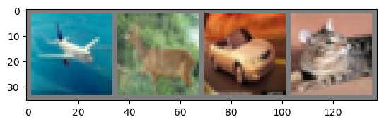
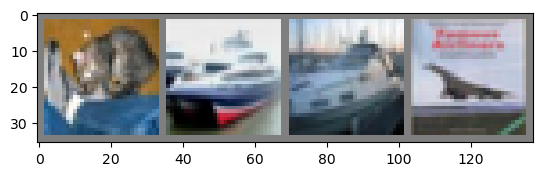

# PyTorch image classifier walkthrough

This notebook serves as an extension to the PyTorch tutorial that will get you started with basic image classification. It is based on the following tutorial (https://pytorch.org/tutorials/beginner/blitz/cifar10_tutorial.html#) and includes modifications that you will need to get the tutorial working.


```python
import torch
```

To use torchvision to your notebook, you'll need to first go back to your terminal and run the command 'conda install torchvision'. Once the installation is finished, run the below codeblock to import it.


```python
import torchvision
```


```python
import torchvision.transforms as transforms
```


```python
transform = transforms.Compose(
    [transforms.ToTensor(),
     transforms.Normalize((0.5, 0.5, 0.5), (0.5, 0.5, 0.5))])

batch_size = 4

trainset = torchvision.datasets.CIFAR10(root='./data', train=True,
                                        download=True, transform=transform)
trainloader = torch.utils.data.DataLoader(trainset, batch_size=batch_size,
                                          shuffle=True, num_workers=2)

testset = torchvision.datasets.CIFAR10(root='./data', train=False,
                                       download=True, transform=transform)
testloader = torch.utils.data.DataLoader(testset, batch_size=batch_size,
                                         shuffle=False, num_workers=2)

classes = ('plane', 'car', 'bird', 'cat',
           'deer', 'dog', 'frog', 'horse', 'ship', 'truck')

```

    Files already downloaded and verified


    /users/mdunlavy/.local/lib/python3.9/site-packages/torch/utils/data/dataloader.py:478: UserWarning: This DataLoader will create 2 worker processes in total. Our suggested max number of worker in current system is 1, which is smaller than what this DataLoader is going to create. Please be aware that excessive worker creation might get DataLoader running slow or even freeze, lower the worker number to avoid potential slowness/freeze if necessary.
      warnings.warn(_create_warning_msg(


    Files already downloaded and verified


To use matplotlib, you'll need to first go back to your terminal and run the command 'conda install matplotlib'. You'll then be able to use the plot function for the below training and classification. 


```python
import matplotlib.pyplot as plt
import numpy as np

# functions to show an image


def imshow(img):
    img = img / 2 + 0.5     # unnormalize
    npimg = img.numpy()
    plt.imshow(np.transpose(npimg, (1, 2, 0)))
    plt.show()


# get some random training images
dataiter = iter(trainloader)
images, labels = next(dataiter)

# show images
imshow(torchvision.utils.make_grid(images))
# print labels
print(' '.join(f'{classes[labels[j]]:5s}' for j in range(batch_size)))
```


    

    


    plane deer  car   cat  


```python
import torch.nn as nn
import torch.nn.functional as F


class Net(nn.Module):
    def __init__(self):
        super().__init__()
        self.conv1 = nn.Conv2d(3, 6, 5)
        self.pool = nn.MaxPool2d(2, 2)
        self.conv2 = nn.Conv2d(6, 16, 5)
        self.fc1 = nn.Linear(16 * 5 * 5, 120)
        self.fc2 = nn.Linear(120, 84)
        self.fc3 = nn.Linear(84, 10)

    def forward(self, x):
        x = self.pool(F.relu(self.conv1(x)))
        x = self.pool(F.relu(self.conv2(x)))
        x = torch.flatten(x, 1) # flatten all dimensions except batch
        x = F.relu(self.fc1(x))
        x = F.relu(self.fc2(x))
        x = self.fc3(x)
        return x


net = Net()
```


```python
import torch.optim as optim

criterion = nn.CrossEntropyLoss()
optimizer = optim.SGD(net.parameters(), lr=0.001, momentum=0.9)
```


```python
for epoch in range(2):  # loop over the dataset multiple times

    running_loss = 0.0
    for i, data in enumerate(trainloader, 0):
        # get the inputs; data is a list of [inputs, labels]
        inputs, labels = data

        # zero the parameter gradients
        optimizer.zero_grad()

        # forward + backward + optimize
        outputs = net(inputs)
        loss = criterion(outputs, labels)
        loss.backward()
        optimizer.step()

        # print statistics
        running_loss += loss.item()
        if i % 2000 == 1999:    # print every 2000 mini-batches
            print(f'[{epoch + 1}, {i + 1:5d}] loss: {running_loss / 2000:.3f}')
            running_loss = 0.0

print('Finished Training')
```

    /users/mdunlavy/.local/lib/python3.9/site-packages/torch/nn/functional.py:718: UserWarning: Named tensors and all their associated APIs are an experimental feature and subject to change. Please do not use them for anything important until they are released as stable. (Triggered internally at  /pytorch/c10/core/TensorImpl.h:1156.)
      return torch.max_pool2d(input, kernel_size, stride, padding, dilation, ceil_mode)


    [1,  2000] loss: 2.211
    [1,  4000] loss: 1.886
    [1,  6000] loss: 1.695
    [1,  8000] loss: 1.596
    [1, 10000] loss: 1.533
    [1, 12000] loss: 1.478
    [2,  2000] loss: 1.428
    [2,  4000] loss: 1.370
    [2,  6000] loss: 1.379
    [2,  8000] loss: 1.342
    [2, 10000] loss: 1.326
    [2, 12000] loss: 1.294
    Finished Training


```python
PATH = './cifar_net.pth'
torch.save(net.state_dict(), PATH)
```


```python
dataiter = iter(testloader)
images, labels = next(dataiter)

# print images
imshow(torchvision.utils.make_grid(images))
print('GroundTruth: ', ' '.join(f'{classes[labels[j]]:5s}' for j in range(4)))
```


    

    


    GroundTruth:  cat   ship  ship  plane


```python
net = Net()
net.load_state_dict(torch.load(PATH))
```


    <All keys matched successfully>


```python
outputs = net(images)
```


```python
_, predicted = torch.max(outputs, 1)

print('Predicted: ', ' '.join(f'{classes[predicted[j]]:5s}'
                              for j in range(4)))
```

    Predicted:  cat   plane plane plane


```python
correct = 0
total = 0
# since we're not training, we don't need to calculate the gradients for our outputs
with torch.no_grad():
    for data in testloader:
        images, labels = data
        # calculate outputs by running images through the network
        outputs = net(images)
        # the class with the highest energy is what we choose as prediction
        _, predicted = torch.max(outputs.data, 1)
        total += labels.size(0)
        correct += (predicted == labels).sum().item()

print(f'Accuracy of the network on the 10000 test images: {100 * correct // total} %')
```

    Accuracy of the network on the 10000 test images: 52 %


```python
# prepare to count predictions for each class
correct_pred = {classname: 0 for classname in classes}
total_pred = {classname: 0 for classname in classes}

# again no gradients needed
with torch.no_grad():
    for data in testloader:
        images, labels = data
        outputs = net(images)
        _, predictions = torch.max(outputs, 1)
        # collect the correct predictions for each class
        for label, prediction in zip(labels, predictions):
            if label == prediction:
                correct_pred[classes[label]] += 1
            total_pred[classes[label]] += 1


# print accuracy for each class
for classname, correct_count in correct_pred.items():
    accuracy = 100 * float(correct_count) / total_pred[classname]
    print(f'Accuracy for class: {classname:5s} is {accuracy:.1f} %')
```

    Accuracy for class: plane is 70.6 %
    Accuracy for class: car   is 68.9 %
    Accuracy for class: bird  is 43.7 %
    Accuracy for class: cat   is 27.8 %
    Accuracy for class: deer  is 29.6 %
    Accuracy for class: dog   is 28.6 %
    Accuracy for class: frog  is 85.9 %
    Accuracy for class: horse is 62.1 %
    Accuracy for class: ship  is 62.0 %
    Accuracy for class: truck is 50.0 %


```python
device = torch.device('cuda:0' if torch.cuda.is_available() else 'cpu')

# Assuming that we are on a CUDA machine, this should print a CUDA device:

print(device)
```


```python
net.to(device)
```


    Net(
      (conv1): Conv2d(3, 6, kernel_size=(5, 5), stride=(1, 1))
      (pool): MaxPool2d(kernel_size=2, stride=2, padding=0, dilation=1, ceil_mode=False)
      (conv2): Conv2d(6, 16, kernel_size=(5, 5), stride=(1, 1))
      (fc1): Linear(in_features=400, out_features=120, bias=True)
      (fc2): Linear(in_features=120, out_features=84, bias=True)
      (fc3): Linear(in_features=84, out_features=10, bias=True)
    )


```python
inputs, labels = data[0].to(device), data[1].to(device)
```

<p class="carc-provenance" markdown>Migrated from [UNM-CARC QuickBytes](https://github.com/UNM-CARC/QuickBytes/blob/master/PyTorch_Classifier_Xena%20.ipynb){target=_blank} (last source update 2023-09-20). Spotted a problem? [Open an issue or pull request](https://github.com/UNM-CARC/QuickBytes){target=_blank}.</p>
