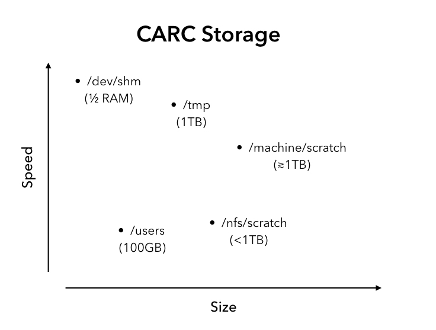

# Storage and backups

CARC provides home, project, and scratch storage on all compute systems.
The paths and quotas on this page reflect direct observation of the
clusters on 2026-07-25; the `quotas` command always shows the current
numbers for your own account.

- **Home** — `/users/<username>`. The same filesystem on every CARC
  machine, so your home directory is identical wherever you log in.
- **Project storage** — under `/projects`, allocated per project through
  [ColdFront](https://coldfront.alliance.unm.edu){target=_blank}.
- **Scratch** — two distinct tiers:
    - **Center-wide scratch** — `/carc/scratch/users/<username>` and
      `/carc/scratch/projects/...`, mounted on **both** Easley and Hopper
      (one shared BeeGFS filesystem, physically hosted on Hopper).
    - **Easley-local scratch** — `/easley/scratch/users/<username>` and
      `/easley/scratch/projects/...`, a separate, larger GPFS tier that
      exists **only on Easley**. Files not accessed for 180 days are
      automatically deleted (cleanup by last-access time).

!!! note "Hopper has no machine-local scratch"

    There is no `/hopper/scratch`. On Hopper your only scratch tier is
    center-wide `/carc/scratch` — a real asymmetry between the two
    clusters, not just a naming difference.

## Storage at CARC

CARC supports a number of different storage devices for users to read, write, and store their data and results on. The different devices vary in size, I/O speed (Figure 1), distance to the reading/writing process using them, whether they have quotas to limit their use, and whether they are backed up or not. Certain storage devices, like the home directories and the scratch filesystems, are shared resources, and serve multiple users simultaneously. This means that problems caused by poorly chosen storage locations could interrupt the work of other users as well as your own. Don’t hesitate to open a help ticket if you have any questions about, for example, where to store a large dataset, how to read it quickly, how to write a Slurm batch script that first moves data onto the compute node in order to take advantage of the fast I/O, or any other issue related to storage at CARC.

For quota numbers and file-count limits see the [resource limits page](resource-limits.md).

## Types of Storage

At CARC, there are four different types of storage:

* Home directory - `/users/username` - Upon logging into any CARC machine, you will find yourself in your home directory (which also goes by `~` and `$HOME`). Home directories are not part of any specific machine: they live on separate enterprise storage mounted by every login and compute node at CARC, which is why their contents are identical on every cluster. Home is backed up and is the right place for source code, scripts, and other hard-to-reproduce files — not for heavy job I/O.

* Scratch - the working space for data generated by running calculations, before it is analyzed and then either downloaded, deleted, or moved when a long-term storage or archival plan is implemented. Every user has center-wide scratch at `/carc/scratch/users/username` (available on both clusters); on Easley you additionally have the larger Easley-local tier at `/easley/scratch/users/username`. Scratch is **not backed up**, and Easley-local scratch is automatically cleaned: files unused for 180 days (by last-access time) are deleted and cannot be recovered. Treat every scratch tier as temporary space.

* Project storage - allocated through [ColdFront](https://coldfront.alliance.unm.edu){target=_blank} by your project's PI (or a user the PI has designated as a manager on the project). It comes in two flavors with a real tradeoff: **backed-up project storage** (under `/projects`; protected against loss, the safe default for data that must persist) and **non-backed-up project scratch** (under `/carc/scratch/projects/...` or `/easley/scratch/projects/...`; larger, but carries the same "not protected" caveat as personal scratch). See the [FAQ on long-term storage](../faq/general.md#storage-and-data).

* Node-local storage (only on the compute nodes) - `/tmp` and `/dev/shm`. On machines that support it, compute nodes have their own hard drives, accessed by creating a directory in `/tmp` (see the sample script below); since the drive is dedicated to that node, this is one of the fastest places for I/O. `/dev/shm` is direct access to the node's memory presented as a filesystem — extremely fast for small temporary files that are written and read often, but it competes directly with the RAM your processes use. Both are cleared at the end of the job, so move anything you want to keep off the compute node before the job or its walltime ends.



Figure 1. The various storage locations plotted by their relative size and I/O speed.

## Finding your project space path

Project allocations follow these observed path shapes:

- **Easley-local project scratch**:
  `/easley/scratch/projects/<pi-username>/<pi-username><project-id>` —
  consistent for every allocation checked.
- **Center-wide project scratch**: usually
  `/carc/scratch/projects/<pi-username>/<pi-username><project-id>`, but
  the naming is **not** consistently nested — some allocations sit
  directly under `/carc/scratch/projects/` with no PI subfolder. Don't
  construct this path by analogy; look it up.

If a newly approved allocation's path doesn't exist yet, provisioning may
not have finished — check the allocation's status in
[ColdFront](https://coldfront.alliance.unm.edu){target=_blank}, and
[open a ticket](../support/help.md) if you can't find or can't access
your space.

## Choosing a storage type

In order to determine which storage type to use, it may be helpful to consider which of the following broad categories your data falls into:

1. Data that is hard to produce and long-lived - Eg. source code, scripts, documents, results. This data is either used to produce or is the product of other calculations and work

2. Results and temporary data - This is data that is produced by your calculations such as simulation logs and are typically further analyzed or have some data of interest extracted and summarized, perhaps even reported in a publication. This data can be regenerated relatively easily, by rerunning the calculation that produced it, and is often deleted once further processed or at most, at the end of a project.

We recommend that the first type of data be stored in your home directory, which is available from everywhere inside the CARC network and is backed up. The second kind of data is best produced/stored on the scratch filesystems. In cases of very high I/O, that data can temporarily be moved to the compute node and onto either the hard drive (if the machine in use has an internal hard drive) or onto shared memory (if the files are very small). An obvious benefit to using devices that are very close to the CPU and are typically only used by a single user at a time, is the high read and write speed available (Figure 1). The cost of this speed is the fact that the data must be moved to the compute node, read in by the calculation, and anything that is intended to be saved must be moved back off the compute node before the end of walltime or before the job ends, when the compute node is returned to the general resource pool.

## What is backed up

- **Home and backed-up project storage** live on enterprise (NetApp)
  storage with automated snapshots (hourly to monthly, retained up to
  four months). To recover a deleted file, [open a ticket](../support/help.md).
- **Scratch is never backed up** — neither the center-wide nor the
  Easley-local tier — and Easley-local scratch is additionally cleaned
  up automatically after 180 days without access. No published cleanup
  window exists for center-wide scratch; don't assume it is kept
  indefinitely.

## Example use of a node's hard drive

This Slurm script first copies an input file (large_input_data.dat) to the compute node, runs the calculation ("run_my_program"), and then copies all results back into the submission directory:

```bash
#!/bin/bash
#SBATCH --nodes=1
#SBATCH --ntasks=8
#SBATCH --time=1:00:00
#SBATCH --job-name=local_storage

# Define a directory on the node-local disk, create it once the job
# has started, move data there, then cd to it and run
TEMP_DIR=/tmp/$USER/$SLURM_JOB_ID
mkdir -p "$TEMP_DIR"
cp -r $SLURM_SUBMIT_DIR/large_input_data.dat "$TEMP_DIR"
cd $TEMP_DIR

# Now run my program
run_my_program

# The job has finished, so move data back to where it came from
cp -r $TEMP_DIR/* $SLURM_SUBMIT_DIR

# Finally clean up the temporary directory
rm -r $TEMP_DIR
```

## Video walkthrough

**Storage Systems** — from the [CARC video tutorials](../training/videos.md):

<iframe class="carc-video" src="https://www.youtube-nocookie.com/embed/WwsbLyl7d1A" title="Storage Systems" loading="lazy" allow="accelerometer; clipboard-write; encrypted-media; gyroscope; picture-in-picture; web-share" referrerpolicy="strict-origin-when-cross-origin" allowfullscreen></iframe>

<p class="carc-provenance" markdown>Originally migrated from [UNM-CARC QuickBytes](https://github.com/UNM-CARC/QuickBytes/blob/master/storage_and_backup.md){target=_blank}; paths, tiers, and retention reconciled 2026-09-01 against cluster state observed 2026-07-25 ([CARC knowledge store](https://git.repo.alliance.unm.edu/CARC/CARC-knowledge-store){target=_blank}). Spotted a problem? [Open an issue or pull request](https://github.com/UNM-CARC/docs){target=_blank}.</p>
